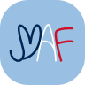

# maf-team2
<p align="center"></p>
<p align="center"><h1>MAF - Mon Ami Français</h1></p>
<p align="center">Mon ami français (MAF) é um aplicativo para auxiliar os professores em sala de aula e entregar uma experiência imersiva  no idioma francês e nas culturas francesa e francófonas em qualquer lugar do mundo.</p>


# Features

- [x] Navegação entre as telas
- [x] Conto com aúdio
- [x] IA para identificar os objetos
- [ ] Integralizar a IA para identificar os objetos pela câmera
- [ ] Geração das cartas a partir dos objetos capturados pela câmera
- [ ] Funcionalidade da tela login
- [ ] Funcionalidade da tela de perfil
- [ ] Implementação dos desafios com os contos
- [ ] Alfabeto com LSF


### Pré-requisitos

Antes de começar, você vai precisar ter instalado em sua máquina as seguintes ferramentas:
[Git](https://git-scm.com), [Node.js](https://nodejs.org/en/), [Java](https://www.java.com/pt-BR/), [Gradle](https://gradle.org/), [Cordova](https://cordova.apache.org/).
Além disto, é bom ter um editor para trabalhar com o código como [VSCode](https://code.visualstudio.com/)

### Protótipo
https://www.figma.com/proto/UdiIY6nujqEQR8jf2VsimG/App-Hacka?page-id=0%3A1&node-id=2%3A24&viewport=241%2C48%2C0.15&scaling=scale-down&starting-point-node-id=2%3A11

### Rodando o code local

```bash
# Clone este repositório
$ git clone <https://github.com/c3bola/maf-team2.git>
npm install

```
### 🛠 Tecnologias

As seguintes ferramentas foram usadas na construção do projeto:

- [Node.js](https://nodejs.org/en/)
- [Java](https://www.java.com/pt-BR/)
- [Gradle](https://gradle.org/)
- [Cordova](https://cordova.apache.org/)

### [Time 2] Contribuidores
- Ana Beatriz 
- c3bola
- Gabriel de Souza Lima
- Reilta Maia
- Vinícius de Oliveira Santos

### Mentoria
Paulo espanha
Isabel Cristina
